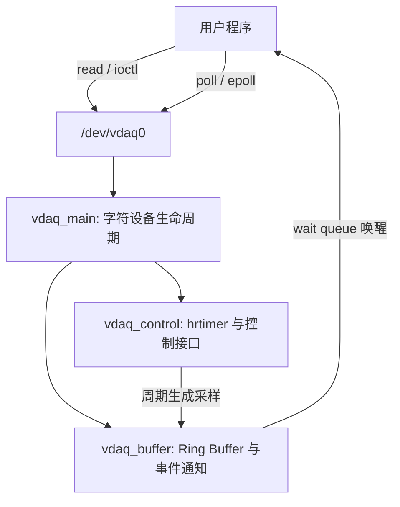

# Virtual DAQ

Virtual DAQ（vDAQ）是一个基于 Linux 内核模块实现的虚拟多通道实时数据采集设备。项目在没有真实采集硬件的情况下，模拟工业 DAQ 设备的数据产生、缓存、
读取和控制流程，并通过字符设备 `/dev/vdaq0` 向用户空间提供统一接口。

项目当前在 LubanCat-5 V2（Linux 5.10.160，AArch64）上完成开发与验证，重点覆盖
字符设备生命周期、实时采样、并发缓冲、阻塞与非阻塞 I/O，以及 poll/epoll
事件通知。

## 已实现功能

- 动态字符设备注册与 `/dev/vdaq0` 生命周期管理
- 基于 hrtimer 的周期采样，默认采样率 100 Hz
- 四通道结构化采样数据与单调时间戳
- Ring Buffer 缓存及覆盖最旧数据策略
- START、STOP、SET_RATE、GET_STATUS、CLEAR_BUFFER ioctl
- 阻塞 `read()`、`O_NONBLOCK` 与 `-EAGAIN` 语义
- wait queue 唤醒及 STOP 状态处理
- `poll()`、epoll LT 和 epoll ET 用户态示例
- 通过 mutex 与 spinlock 分离控制路径和数据路径
- main、buffer、control 三部分复合内核模块架构

## 架构



内核中的主要数据流为：

```text
hrtimer callback
    -> 生成 vdaq_sample
    -> 写入 Ring Buffer
    -> 唤醒 read queue
    -> read/poll/epoll 返回用户空间
```

### 模块职责

| 文件 | 职责 |
| --- | --- |
| `module/vdaq/vdaq_main.c` | 模块加载/卸载、cdev、class、device、open/release |
| `module/vdaq/vdaq_buffer.c` | Ring Buffer、阻塞/非阻塞 read、poll、等待队列 |
| `module/vdaq/vdaq_control.c` | hrtimer、START/STOP、采样率、状态快照、ioctl |
| `module/vdaq/vdaq_internal.h` | 内部结构、常量和跨文件接口 |
| `include/vdaq_uapi.h` | 内核态与用户态共享的稳定 UAPI |

`open()` 通过 `inode->i_cdev` 找到设备对象并保存到 `file->private_data`，后续文件
操作不直接依赖全局设备变量。控制 helper 同时为后续 sysfs 接口预留了复用边界。

## 目录结构

```text
virtual_daq/
├── app/
│   ├── reader.c
│   ├── nonblock_reader.c
│   ├── vdaq_ctl.c
│   ├── vdaq_monitor.c
│   ├── vdaq_epoll_monitor.c
│   ├── vdaq_epoll_et_monitor.c
│   └── Makefile
├── include/
│   └── vdaq_uapi.h
├── module/
│   └── vdaq/
│       ├── vdaq_main.c
│       ├── vdaq_buffer.c
│       ├── vdaq_control.c
│       ├── vdaq_internal.h
│       └── Makefile
├── docs/
├── others/
└── README.md
```

构建生成的 `.o`、`.ko`、`Module.symvers` 和 `app/build/` 不属于源代码结构。

## 快速开始

### 依赖

需要与当前运行内核匹配的 headers、编译工具和 root 权限：

```bash
sudo apt install build-essential linux-headers-$(uname -r)
```

### 编译

```bash
make -C module/vdaq
make -C app
```

输出文件：

```text
module/vdaq/vdaq.ko
app/build/reader
app/build/vdaq_ctl
app/build/vdaq_monitor
app/build/vdaq_epoll_monitor
app/build/vdaq_epoll_et_monitor
```

### 加载与卸载

```bash
sudo insmod module/vdaq/vdaq.ko
ls -l /dev/vdaq0
dmesg -TW

sudo rmmod vdaq
```

如果当前系统没有配置相应 udev 权限规则，可在开发测试时临时执行：

```bash
sudo chmod 666 /dev/vdaq0
```

### 控制设备

```bash
app/build/vdaq_ctl get_status
app/build/vdaq_ctl stop
app/build/vdaq_ctl clear
app/build/vdaq_ctl rate 200
app/build/vdaq_ctl start
```

### 读取与事件监听

```bash
# 阻塞读取一帧
app/build/reader

# 空缓冲时立即返回
app/build/nonblock_reader

# poll
app/build/vdaq_monitor

# epoll 水平触发（LT），同时监听设备和标准输入
app/build/vdaq_epoll_monitor

# epoll 边沿触发（ET）
app/build/vdaq_epoll_et_monitor
```

epoll 示例中可输入 `q` 退出。

## 数据与接口

### 采样格式

```c
struct vdaq_sample {
    uint64_t timestamp_ns;
    uint32_t sequence;
    int16_t channel[4];
    uint16_t status;
};
```

- `timestamp_ns`：基于单调时钟的纳秒时间戳
- `sequence`：递增采样序号
- `channel[4]`：四路模拟采样值
- `status`：采样状态字段

### ioctl

| 命令 | 作用 |
| --- | --- |
| `VDAQ_IOCTL_GET_STATUS` | 获取运行状态、序号、缓冲位置和统计信息 |
| `VDAQ_IOCTL_START` | 启动周期采样；重复调用保持幂等 |
| `VDAQ_IOCTL_STOP` | 停止采样并唤醒阻塞读取者 |
| `VDAQ_IOCTL_CLEAR_BUFFER` | 清空未读取采样 |
| `VDAQ_IOCTL_SET_RATE` | 设置 1～10000 Hz 采样率 |

### read 与事件语义

- 设备运行且缓冲区为空：阻塞 `read()` 进入等待队列。
- 使用 `O_NONBLOCK` 且缓冲区为空：立即返回 `-EAGAIN`。
- 缓冲区有数据：poll/epoll 返回 `EPOLLIN | EPOLLRDNORM`。
- 设备停止且无剩余数据：poll/epoll 返回 `EPOLLHUP`。
- STOP 后仍有缓存数据时，用户可以先读取剩余帧。

## Ring Buffer 与并发

物理数组包含 1024 个槽位。当前实现以 `head == tail` 表示空，因此保留一个槽位
用于区分空和满，有效容量为 1023 帧。

缓冲区满后，新数据覆盖最旧数据：

```text
head 前进
tail 同步前进
dropped_samples++
buffer_overflows++
```

- `data_lock`（spinlock）保护 Ring Buffer 和数据路径统计。
- `control_lock`（mutex）串行化 START、STOP 与采样率修改。
- `copy_to_user()` 在释放 spinlock 后执行，避免在自旋锁临界区中发生睡眠。
- `hrtimer_cancel()` 不在 spinlock 临界区中调用。

## 已完成验证

- 100 Hz、200 Hz 和 1 Hz 动态采样
- 1 Hz 非阻塞读取立即返回 `EAGAIN`
- 1 Hz 阻塞读取约 1 秒后返回数据
- STOP 唤醒阻塞 reader：2/2 用例通过
- poll 与 epoll LT 的数据、stdin、超时和 HUP 路径
- epoll ET 用户态示例构建
- `strace` 观察到程序阻塞于 `epoll_pwait()`
- Ring Buffer 覆盖和 dropped/overflow 统计
- 加载—读取—卸载循环：50/50 通过
- 模块化后内核构建与 checkpatch：0 error、0 warning

## 文档

- [系统架构](docs/architecture.md)
- [驱动设计](docs/driver_design.md)
- [ioctl 接口](docs/ioctl_interface.md)
- [测试报告](docs/test_report.md)
- [开发记录](docs/development_log.md)
- [字符设备生命周期](others/driver_lifecycle.md)
- [定时器与环形缓冲](others/timer_ring_buffer.md)

## Roadmap

- [ ] 阶段 5：sysfs 正式配置与 debugfs 调试接口
- [ ] 阶段 6：故障注入与故障历史
- [ ] 阶段 7：健康状态机与自动恢复
- [ ] 阶段 8：并发压力测试和内核调试
- [ ] 阶段 9：mmap 数据通路与性能对比
- [ ] 阶段 10：文档、演示和面试复盘
- [ ] 真实硬件扩展：LubanCat-5 V2 + HC-SR04（暂缓）
